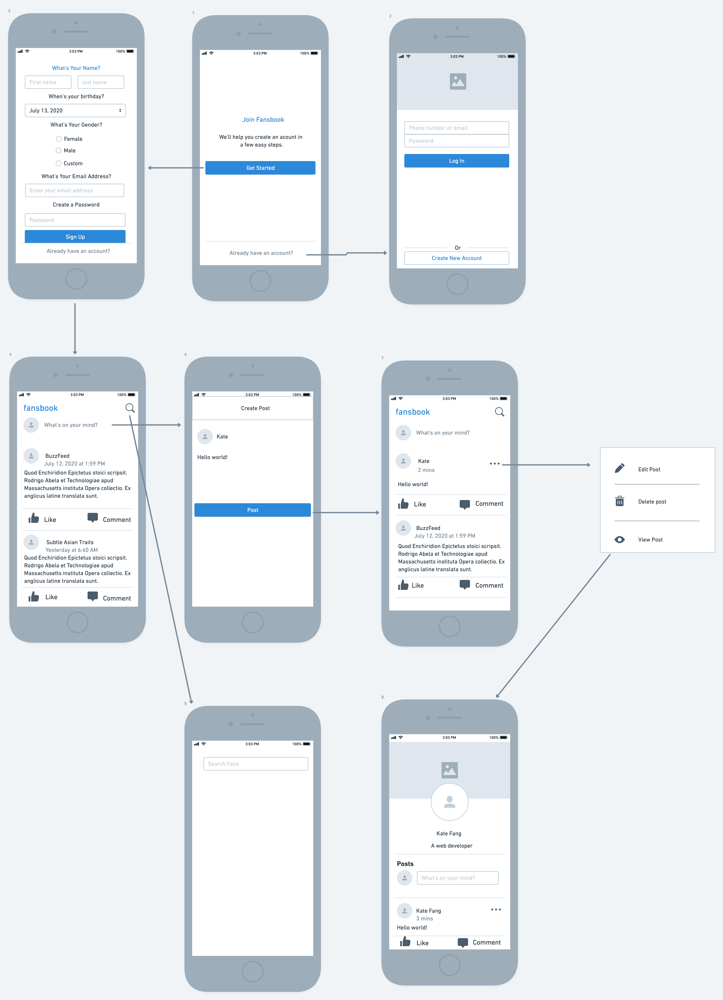
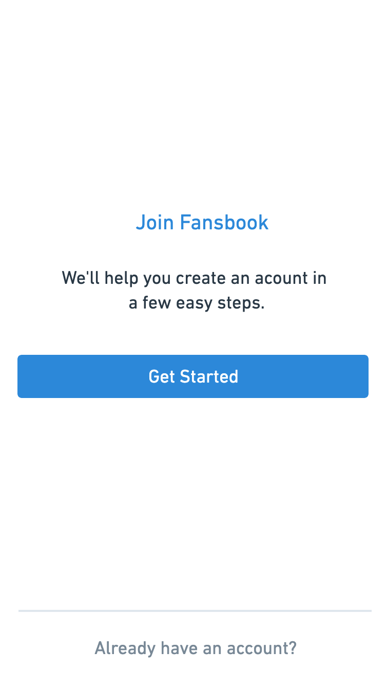
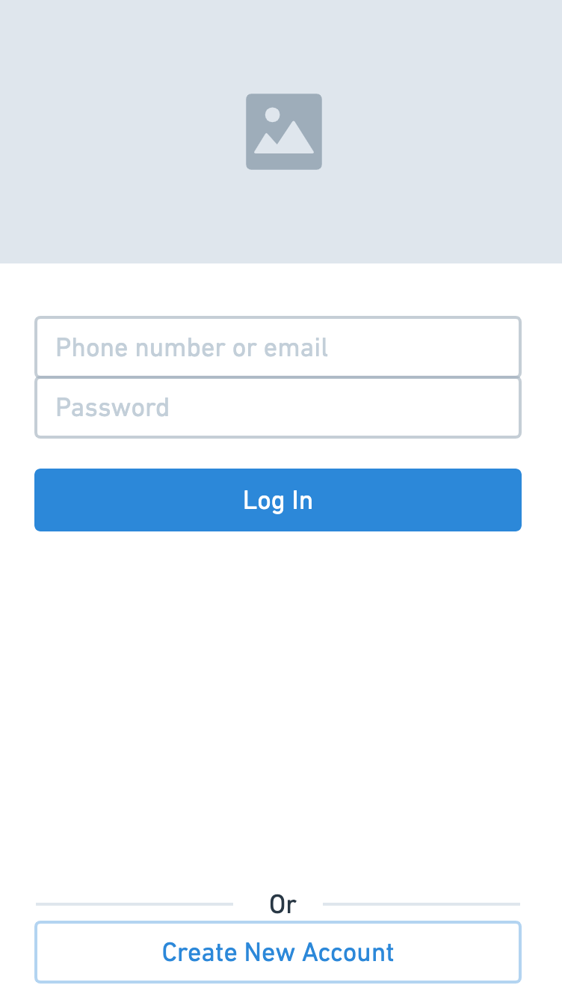
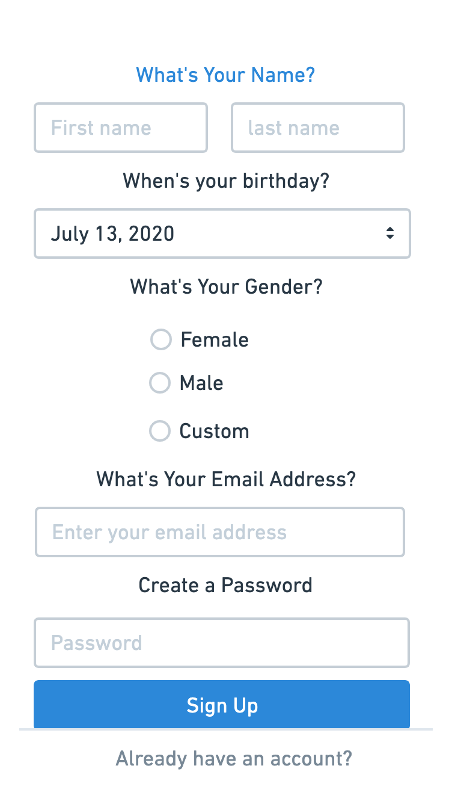
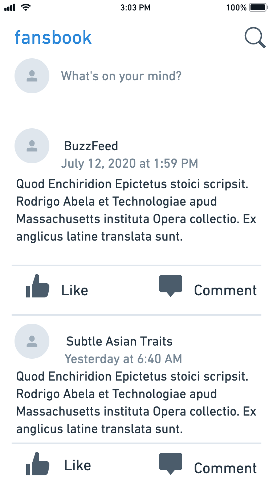
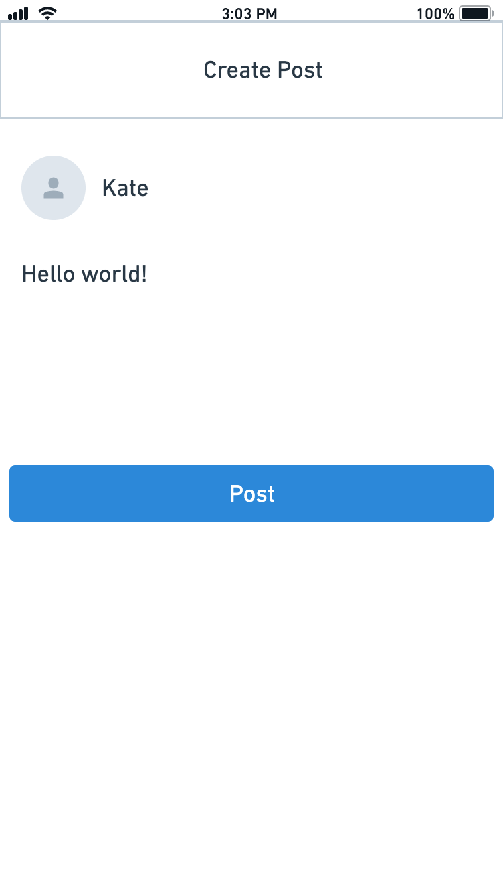
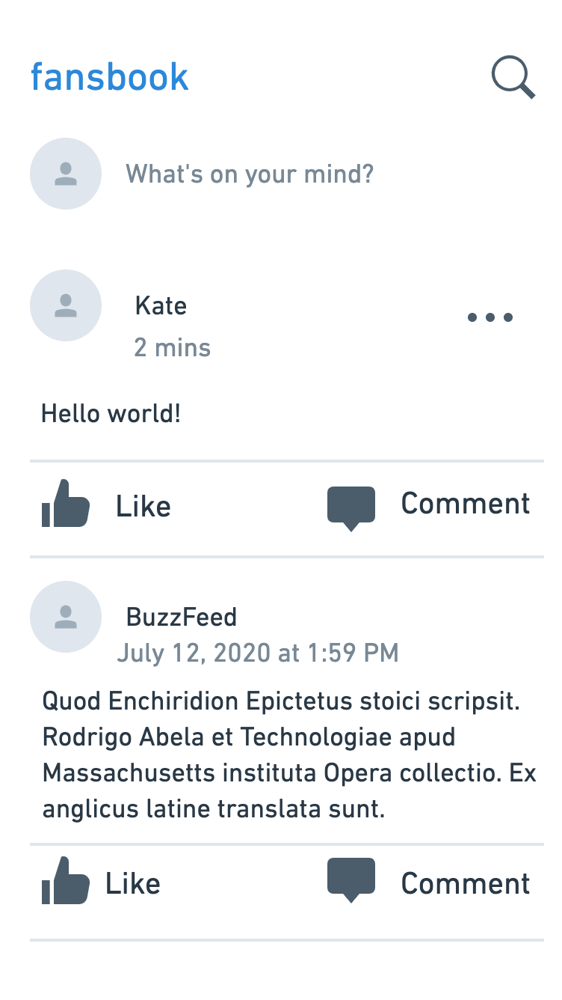
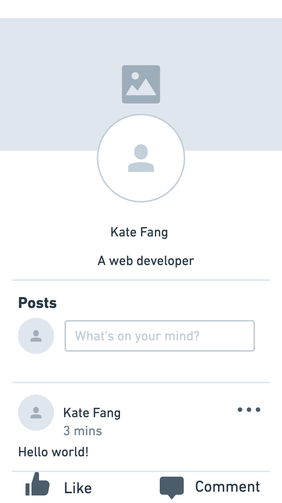

# Pagebook

- [Overview](#overview)
- [MVP](#mvp)
  - [Goals](#goals)
  - [Libraries and Dependencies](#libraries-and-dependencies)
  - [Client (Front End)](#client-front-end)
    - [Wireframes](#wireframes)
    - [Component Tree](#component-tree)
    - [Component Hierarchy](#component-hierarchy)
    - [Component Breakdown](#component-breakdown)
    - [Time Estimates](#time-estimates)
  - [Server (Back End)](#server-back-end)
    - [ERD Model](#erd-model)
- [Post-MVP](#post-mvp)
- [Code Showcase](#code-showcase)
- [Code Issues & Resolutions](#code-issues--resolutions)

<br>

## Overview

_**Pagebook** is a attempted replica of Facebook with basic functionalities_

<br>

## MVP

_**Pagebook** will have_

- Posts CRUD
- User Sign Up and Sign In functionalities
- User Auth

<br>

### Goals

- Users will be able to CRUD posts
- User will be able to like and comment on everyone's posts

<br>

### Libraries and Dependencies

|     Library     | Description                                         |
| :-------------: | :-------------------------------------------------- |
|      React      | _Will use React for the front end_                  |
|  React Router   | _Route Users to different pages_                    |
| React Bootstrap | _Will use Bootstrap to speed up front end building_ |
|      Rails      | _Will use rails for the backend_                    |
|      Rails      | _Will use rails for the backend_                    |
|     Bcrypt      | _User Encryption_                                   |
|       JWT       | _User Auth_                                         |

<br>

### Client (Front End)

#### Wireframes

#### Overview



#### Landing Page



<hr/>

#### Log In Page



<hr/>

#### Create Account Page



<hr/>

#### Homepage



<hr/>

#### Search Page


<hr/>

#### Create Post Page



<hr/>

#### Homepage 2



#### Profile Page



#### Component Hierarchy

```structure

src
|__ images
|__components/
    |__avatar.component.jsx
    |__feed.component.jsx
    |__feed-header.component.jsx
    |__feed.component.jsx
    |__header.component.jsx
    |__make-post.component.jsx
    |__modal.component.jsx
    |__profile.component.jsx
    |__reply-box.component.jsx
    |__show-comment.component.jsx
    |__users-pane.component.jsx
|__ views/
    |__admin-profile.view.jsx
    |__create-account.view.jsx
    |__create-post.view.jsx
    |__homepage.view.jsx
    |__landing.view.jsx
    |__login .view.jsx
    |__update-post.view.jsx
    |__user-profile.view.jsx
    |__view-post.view.jsx
|__context/
    |__admin-context.jsx
|__ services/
    |__ apiHelper.js
    |__ user.js
    |__ auth.js

```

#### Component Breakdown

|   Component    |    Type    | state | props | Description                             |
| :------------: | :--------: | :---: | :---: | :-------------------------------------- |
|     header     | functional |   y   |   y   | _header for some pages_                 |
|  landing-page  | functional |   y   |   y   | _landing page aka getting started page_ |
|   login-page   | functional |   y   |   y   | _user login page_                       |
| create-account | functional |   y   |   y   | _new user create account page_          |
|    homepage    | functional |   y   |   y   | _homepage with friend's posts_          |

#### Time Estimates

| Task      | Priority | Estimated Time | Time Invested | Actual Time |
| --------- | :------: | :------------: | :-----------: | :---------: |
| CSS       |    H     |     20 hrs     |    20 hrs     |   20 hrs    |
| Front End |    VH    |     30 hrs     |    30 hrs     |   30 hrs    |
| Back End  |    H     |     15 hrs     |     5 hrs     |    5 hrs    |
| TOTAL     |          |     65 hrs     |    55 hrs     |   55 hrs    |

<br>

### Server (Back End)

#### ERD Model


